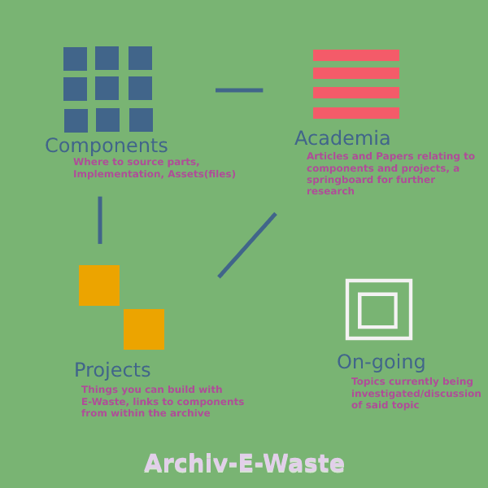

# Archiv-E-Waste: An open-source E-Waste recycling archive for the centralization of useful information and research

<h2> Motivation:</h2>

E-Waste recycling is becoming an increasingly mainstream topic, and perhaps finds even more relevance due to the on-going global chip shortage.Throughout the course of researching the topic, it became clear there exists a wide variety of e-waste projects, but a significant lack in the centralization of useful information. The goal of this project is to create a platform that encourages collaboration into the development of useful e-waste components. Ideally, a collection of  components (servo designs, actuators, sensors, controllers) is created, providing information such as where to find the electronic and mechanical components, and how to assemble the end product. The cornerstone is ensuring the accessibility of components and materials to EVERYONE. This democratization of robotics allows for a wider reach of research and development in the field.

The Archiv-E also serves as a method of reducing cost/consumption for existing projects, a situation may arise where a section of required components are accessible, but specific components may not due to lead times or geo-economic factors. Particularly at the hobby level. Prototyping a project can be expensive and if all that is required is a proof of concept then the ability to create this from recyclable materials is very desirable. Being able to reduce the cost as well as reduce the impact on the environment is always going to be desirable.

<h2> Structure:</h2>

<h2>How to Contribute:</h2>

Direct contribution can be made by directly by forking the repositry (if this is all new to you check out the tutorials folder) and submitting a pull request.

Say for example the contribution is a component that you have made in your own git repo. You simply fork this repository and link your component as a submodule. Then submit a pull request and BAM! you have helped contribute to make the world a more sustainable and awesome place :D It is important to ensure that the submodule fits the standardized structure of its section, for components this means it must include an assembly (how to build the component), ingredients (where to find the parts), and src or assets folder (contains code, stl files, etc)

There are many other ways you can indirectly contribute, sharing the project, translating documents or tutorials to different languages, reviewing pull requests, submitting articles and papers to the research section, contributing ideas and more! 